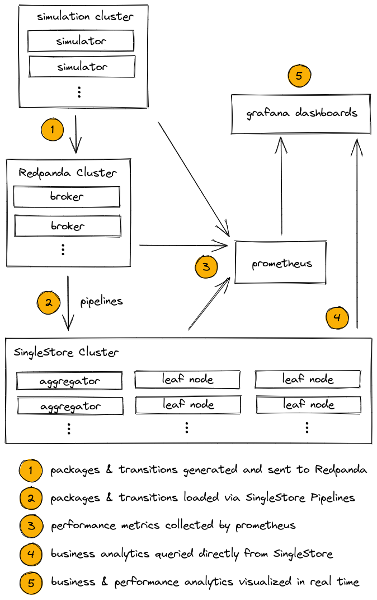

# Reference Architecture using SingleStore and Redpanda for global logistics

> **📯 INFO:** For the story behind this code (and epic dashboards), [check out the blog post](https://www.singlestore.com/blog/scaling-worldwide-parcel-logistics-with-singlestore-and-vectorized/)!

This repository provides a reference architecture which simulates the parcel
tracking system of a hypothetical global logistics company using
[SingleStore](https://singlestore.com) and [Redpanda](https://vectorized.io/).

## Architecture overview



## Data model


## Running locally

1. [Sign up](https://www.singlestore.com/try-free/) for a free SingleStore license.  This allows you to run up to 4 nodes up to 32 gigs each for free. Grab your license key from [SingleStore portal](https://portal.singlestore.com/?utm_medium=osm&utm_source=github) and set it as an environment variable.

```bash
export SINGLESTORE_LICENSE="<<singlestore license>>"
```

2. Run the simulation locally using `make` and then check that everything is running correctly using `docker-compose ps`

```bash
$ make
...SNIP output...
Successfully built fad3bf30af1d
Successfully tagged singlestore-logistics-simulator:latest
Creating simulator ... done

$ docker-compose ps
   Name                 Command               State
---------------------------------------------------
grafana      /run.sh                          Up
prometheus   /bin/prometheus --config.f ...   Up
rp-node-0    /usr/bin/rpk redpanda star ...   Up
rp-setup     /bin/bash -c rpk --brokers ...   Exit 0
s2-agg-0     /startup                         Up
simulator    ./simulator --config confi ...   Up
```

> **NOTE:** If you are running the above on a mac you may need to increase the docker system resources. We have found that 6 GB of RAM and 2 CPUs is sufficient to run this demo - but the more you provide to docker the faster things will go. :)

3. You can also check the logs using

```bash
make logs

# or specify a specific service like so:
make logs SERVICE=simulator
```

At this point you can open up any of the services below to view dashboards, cluster information or run queries against the dataset:

| service     | url                   | user | password |
|-------------|-----------------------|------|----------|
| Grafana     | http://localhost:3000 | root | root     |
| SingleStore | http://localhost:8080 | root | root     |
| Prometheus  | http://localhost:9090 |      |          |

> **NOTE**: The node exporter is not run locally, so the node exporter dashboard will not work out of the box.

## Deploying into Google Cloud

This repo contains a full Terraform based deployment solution which will result in this simulator running at nearly unlimited scale in the cloud.

> **WARNING**: Before running this in your own environment be cautious to read the variables carefully and tune it to your own appetite. **It's easy to burn a lot of money very quickly.** SingleStore and Vectorized do not take responsibility for any costs or issues you may have while using this repository. Please be careful.

Without going into too much detail (if you want to do this, you need to understand how Terraform works), follow these steps to run everything in Google Cloud:

1. Create `deploy/terraform-gcp/terraform.tfvars` to set variables. You will need at least these variables set to continue:

```
project_name = "YOUR PROJECT NAME"
region = "THE REGION YOU WANT TO USE"
zone = "THE ZONE YOU WANT TO USE: i.e. a, b, c"

s2_license = "YOUR SINGLESTORE LICENSE KEY - GET THIS FROM THE PORTAL"
```

2. Deploy! (make sure to read everything carefully)

```bash
cd deploy/terraform-gcp
terraform apply
```

3. Grafana, Studio, and Prometheus are running locally on the logistics-dashboard which you can access via the following port forwarding options:

```bash
gcloud compute ssh logistics-dashboard -- -L 9090:localhost:9090 -L 3000:localhost:3000 -L 8080:localhost:8080
```

## Redpanda topic schemas

The [simulator](simulator) is a go program which generates package histories and writes them into Redpanda topics.

There are two topics:
 - packages
 - transitions

## Packages topic

The packages topic contains a record per package. The record is written when we receive the package in question.

**Avro schema**:

```json
{
    "type": "record",
    "name": "Package",
    "fields": [
        { "name": "PackageID", "type": { "type": "string", "logicalType": "uuid" } },
        { "name": "SimulatorID", "type": "string" },
        { "name": "Received", "type": { "type": "long", "logicalType": "timestamp-millis" } },
        { "name": "DeliveryEstimate", "type": { "type": "long", "logicalType": "timestamp-millis" } },
        { "name": "OriginLocationID", "type": "long" },
        { "name": "DestinationLocationID", "type": "long" },
        { "name": "Method", "type": { "name": "Method", "type": "enum", "symbols": [
            "standard", "express"
        ] } }
    ]
}
```

## Transitions topic

The transitions topic is written to whenever a package changes states. A normal package goes through the following transitions during it's lifetime:

1. arrival scan - the package has been received
2. departure scan - the package has been scanned and put in transit to another location
    * arrival scan and departure scan can occur multiple times as the package moves through our global logistics network
3. delivered - the package has been delivered

> **NOTE**: We don't currently model last-mile delivery, but it's an interesting problem space for a future iteration on this project.

**Avro schema**:

```json
{
    "type": "record",
    "name": "PackageTransition",
    "fields": [
        { "name": "PackageID", "type": { "type": "string", "logicalType": "uuid" } },
        { "name": "Seq", "type": "int" },
        { "name": "LocationID", "type": "long" },
        { "name": "NextLocationID", "type": ["null", "long"] },
        { "name": "Recorded", "type": { "type": "long", "logicalType": "timestamp-millis" } },
        { "name": "Kind", "type": { "name": "Kind", "type": "enum", "symbols": [
            "arrival_scan", "departure_scan", "delivered"
        ] } }
    ]
}
```

## Interesting queries

Please contribute interesting queries on the dataset as you find them!

### Show the full history of a single package

Replace the package id with a package you want to track.

```sql
SELECT
    pt.seq,
    pt.kind,
    current_loc.city,
    current_loc.country,
    GEOGRAPHY_DISTANCE(current_loc.lonlat, destination.lonlat) / 1000 AS distance_to_destination,
    pt.recorded
FROM package_transitions pt
INNER JOIN locations current_loc ON pt.locationid = current_loc.locationid
INNER JOIN packages p ON pt.packageid = p.packageid
INNER JOIN locations destination ON p.destination_locationid = destination.locationid
WHERE pt.packageid = '516aa045-d8df-4363-b250-da335df82269'
ORDER BY seq DESC;
```
